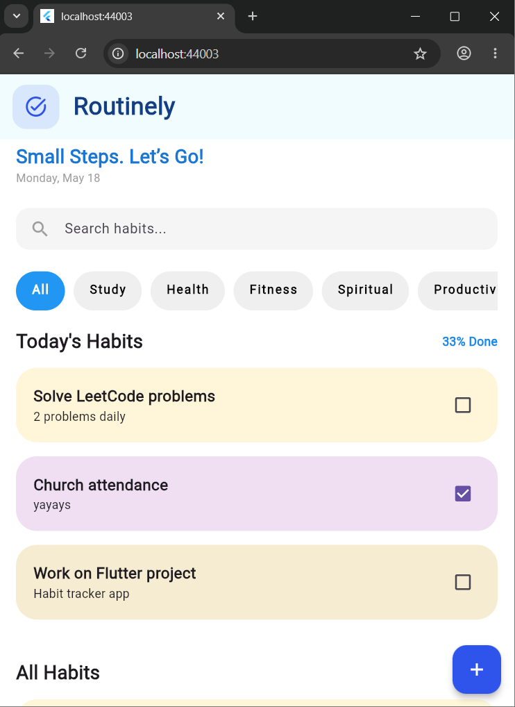

# Routinely – Habit Tracker App

## Overview

Routinely is a Flutter habit tracker application that helps users manage their daily habits.

The app allows users to:

- Add habits
- View habits
- Update habits
- Delete habits
- Mark habits as completed
- Filter habits by category

---

# Technologies Used

- Flutter
- Dart
- Provider
- HTTP
- MockAPI

---

# Features

- Today's habits section
- All habits section
- Category filtering
- Progress tracking
- Clean modern UI
- API integration with CRUD operations

---

# Project Structure

lib/
├── models/
├── providers/
├── screens/
├── services/
├── utils/
└── main.dart

## Screenshots

### Home Screen

### Add Habit

### Edit Habit

